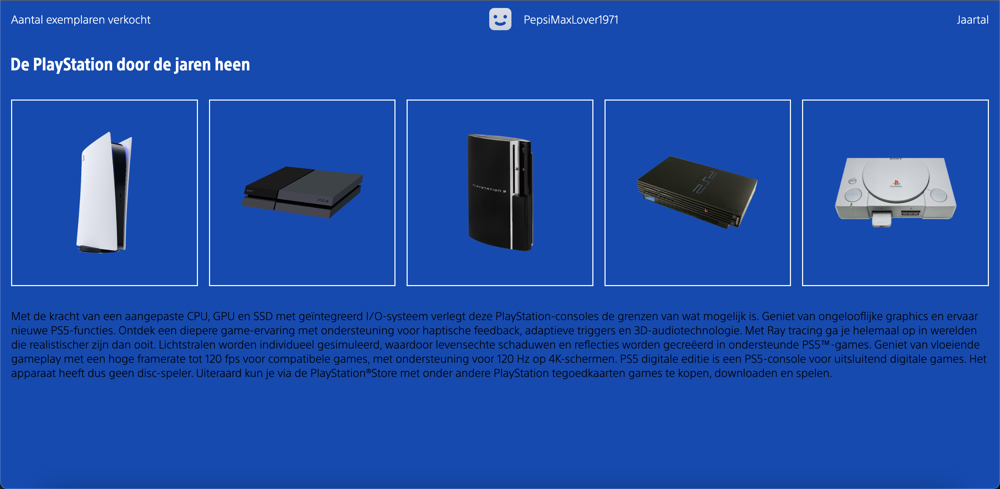

# Procesverslag
Markdown is een simpele manier om HTML te schrijven.  
Markdown cheat cheet: [Hulp bij het schrijven van Markdown](https://github.com/adam-p/markdown-here/wiki/Markdown-Cheatsheet).

Nb. De standaardstructuur en de spartaanse opmaak van de README.md zijn helemaal prima. Het gaat om de inhoud van je procesverslag. Besteedt de tijd voor pracht en praal aan je website.

Nb. Door *open* toe te voegen aan een *details* element kun je deze standaard open zetten. Fijn om dat steeds voor de relevante stuk(ken) te doen.

## Jij

### Ontwerper:
Wessel Glansbeek

#### Je startniveau:
Mijn startniveau is: Blauw

# Je plan

  
De eerste versie/schets van je ontwerp & je persoonlijke uitdaging

  ### De eerste versie/schets:
  

  ### Je ambitie: 
  Aan deze technieken/punten wil ik werken:
  - Comfortabeler worden met css typen
  - Leren functioneel te animeren
  - Positioneren
  - ...
 

## Voortgang/Feedback 1

  
Mijn bevindingen + wijzigingen (minimaal 5)

  ### Bevinding 1:
  Nog niet responsive

  #### oplossing:
  Responsive maken met aspect ratio

  ### Bevinding 2:
  Nog niet interactief genoeg gestijld

  #### oplossing:
  Per Playstation ontwerpen naar de interface van desbetreffende Playstation

  ### Bevinding 3:
  Gebruiker custom maken

  #### oplossing:
  Input prompt

  
  ### Bevinding 4:
  Niet scrollbaar maken

  #### oplossing:
  Goed positioneren van de elementen

  ### Bevinding 5:
  Andere soort content dan alleen droge lap tekst

  #### oplossing:
  Afbeeldingen van controller, populairste games etc.

## Voortgang/Feedback 2

  
Mijn bevindingen + wijzigingen (minimaal 5)

  
  ### Bevinding 1:
  Code nog niet van commentaar voorzien

  #### oplossing:
  Netjes commentaar geven, overzichtelijk, leesbaar, witruimte

  ### Bevinding 2:
  Css properties staan niet in dezelfde volgorde

  #### oplossing:
  Eventueel alfabetisch, of random op chronologische volgorde.

  ### Bevinding 3:
  Geen bronnen in read me

  #### oplossing:
  Bronnen van afbeeldingen toevoegen.

  ### Bevinding 4:
  Meer states toevoegen

  #### oplossing:
  Meer content toevoegen, zodat li's in ol meer states nodig hebben en gehele ontwerp meer interactief is.

  ### Bevinding 5:
  Focus state fixen

  #### oplossing:
  Om hele li ipv img

  ### De voortgang bij tweede feedback:
  
  
  
  

  

## Voortgang/Feedback 3

  
Mijn bevindingen + wijzigingen (minimaal 5)

  
  ### Bevinding 1:
  Nog steeds geen achtergronden per playstation

  #### oplossing:
  Per Playstation een eigen afbeelding met desbetreffende interface

  ### Bevinding 2:
  Nog niet terug kunnen na klikken op een playstation

  #### oplossing:
  Pijltje omhoog toegevoegd zodat je weer terug komt bij de tijdlijn, dit lijkt op de interface van de playstation 5

  ### Bevinding 3:
  Nog steeds geen annotaties

  #### oplossing:
  Html css en js overal netjes commentaar bij

  ### Bevinding 4:
  Code bestanden nog rommelig

  #### oplossing:
  Beautify

  ### Bevinding 5:
  Volgorde code css en js rommelig

  #### oplossing:
  Variabelen bovenaan opslaan in js. Toe te voegen classes bij events onderin bij elkaar in css.

## Reflectie

  
Mijn eindresultaat & persoonlijke ontwikkeling

  ### Je uitkomst - karakteristiek screenshot(s):
  
  

  ### Dit ging goed/Heb ik geleerd: 
  Javascript ging mij goed af, heb alles werkend gekregen zoals ik wilde, ik weet dat het wel met kortere code kan/moet
  Positioneren is gelukt met heel veel pijn en moeite, vind dat het meest frustrerende van developen.

  

  ### Dit was lastig/Is niet gelukt:
  Gebruikersnaam die bovenin verspringt is mij niet gelukt vast te zetten
  Opstarten Playstation video over hele scherm laten afspelen bij openen index. Uiteindelijk gelaten voor wat het is.

  

## Bronnenlijst

continu bijhouden terwijl je werkt

Nb. Wees specifiek ('css-tricks' als bron is bijv. niet specifiek genoeg).

1. Hulp van Sanne
2. Hulp van Jeffrey
3. Veel inspiratie opgedaan uit codepen opdrachten Sanne, maar alles zelf getypt, niks gekopieerd. 
4. Content over Playstations (specificaties) van Wikipedia en Mediamarkt

